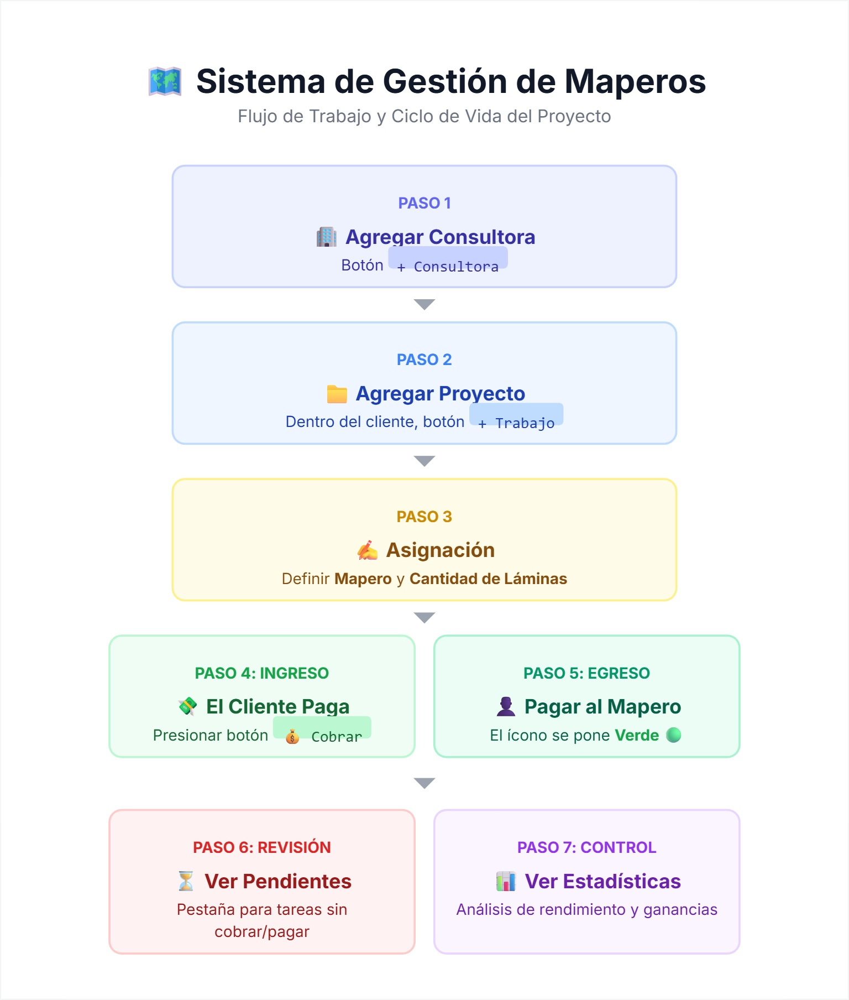

FINANZAS-SIG-UI-MC — Gestión financiera profesional para maperos SIG. Control de clientes, proyectos, pendientes, pagos a maperos, estadísticas y backup local. Diseñado para Paraguay.

# 💰 FINANZAS-SIG-UI-MC


Sistema financiero profesional para **cartógrafos SIG, topógrafos y maperos independientes**. Controla clientes, proyectos, pendientes de cobro, pagos a maperos y estadísticas en tiempo real. Todo funciona **100% offline** en tu navegador — tus datos viven en tu disco.



---

## 📥 Descargar

PROGRAMA HTML

[](https://github.com/marc3ivan/FINANZAS-SIG-UI-MC/releases/download/html/FSIG-UIMC.html)

## 🚀 Características

| Módulo | Función |
|--------|---------|
| **Clientes** | Registro de consultoras con WhatsApp directo |
| **Proyectos** | Cada proyecto tiene: nombre, mapero asignado, láminas, costo por lámina |
| **Cobros** | Marcar/desmarcar pagos recibidos, resumen por cliente |
| **Pagos a Maperos** | Control de quién ya fue pagado y quién no |
| **Estadísticas** | Total bruto, pendiente de cobro, ya cobrado |
| **Multilenguaje** | 🇵🇾 Español · 🇺🇸 English · 🇹🇼 中文 |
| **Backup / Restore** | Exporta/importa JSON, vincula archivo del sistema |

---

## 💾 RESPALDO DE DATOS — LEE ESTO PRIMERO

> ⚠️ **IMPORTANTE:** El navegador guarda los datos automáticamente, pero si borras caché o cookies, **los perderás**. Siempre haz backup.

### 📁 Cómo hacer backup manual (recomendado)

1. Dentro de la app, haz clic en **`💾 Backup`** (arriba a la derecha)
2. Se descargará un archivo `carto_v6.json`
3. Guárdalo en una carpeta segura, por ejemplo:
   - `Documentos / FINANZAS-SIG / backups /`
   - O en tu nube (Google Drive, Dropbox, OneDrive)

### 📂 Cómo restaurar un backup

1. Presiona **`📂 Importar`** en la app
2. Selecciona tu archivo `carto_v6.json`
3. Los datos se cargarán automáticamente

### 🔗 Vincular archivo del sistema (funcionalidad avanzada)

Si quieres que la app **auto-guarde** directamente sobre un archivo en tu computadora:

1. Haz clic en **`🔗 Vincular`**
2. Elige un archivo `.json` existente o crea uno nuevo
3. A partir de ese momento, cada cambio se guarda **simultáneamente** en:
   - LocalStorage del navegador
   - El archivo vinculado en tu disco

> 📍 **Ubicación recomendada para el archivo vinculado:**

| Sistema | Ruta sugerida |
|---------|---------------|
| **Windows** | `C:\Users\TuUsuario\Documents\FINANZAS-SIG\datos.json` |
| **Mac** | `~/Documentos/FINANZAS-SIG/datos.json` |
| **Linux** | `~/Documentos/FINANZAS-SIG/datos.json` |

**¿Por qué vincular?** Porque así tienes doble respaldo: si borras el navegador, el archivo sigue en tus Documentos.

---

## 📥 Cómo usar la app

### Opción A: Usar el HTML directamente (sin internet)

1. Descarga el archivo `FSIG-UIMC.html`
2. Guárdalo en tu computadora, por ejemplo en `Documentos / FINANZAS-SIG /`
3. Haz doble clic para abrirlo con tu navegador (Chrome, Edge, Firefox)
4. **Los datos se guardan solos** — no necesitas instalar nada

### Opción B: Publicar en GitHub Pages (acceso desde cualquier lado)

```bash
# 1. Crea un repositorio en GitHub llamado "FINANZAS-SIG-UI-MC"
# 2. Sube el archivo renombrándolo como index.html
# 3. Ve a Settings > Pages > Branch: main
# 4. En minutos estará online en:
#    https://tuusuario.github.io/FINANZAS-SIG-UI-MC/


```
Si deseas donarme, puedes hacerlo a través de crypto! 🥇

<a href="https://nowpayments.io/donation?api_key=80eb3243-c6e1-419f-acc1-5d38513b794f" target="_blank" rel="noreferrer noopener">
   
</a>

finanzas-sig, mapero, paraguay, gestion-financiera, cartografia, sig, gis, proyectos, cobros, backup-local, uphold, donaciones-crypto
